# Network

## 1.1) записать и сохранить в HAR архив профиль загрузки ресурсов при открытии страницы

[har archive](www.gd.ru.har)

## 1.2) найти неоптимальные места:

  ### 1.2.1)  Дублирование

  - шрифт 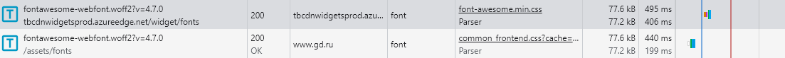
  - скрипт 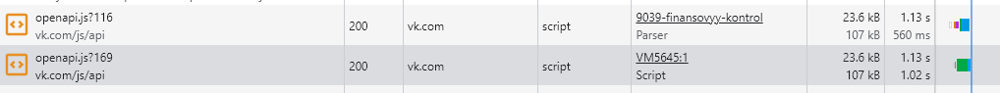
  - скрипт code.js 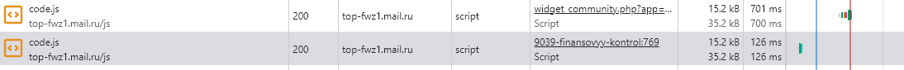
  - пост запрос с одним и тем же payload 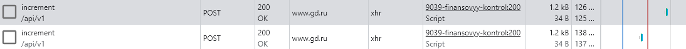
  - фавиконка 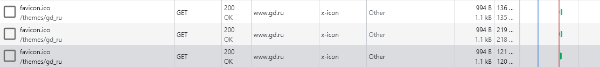
  - иконка рамблер 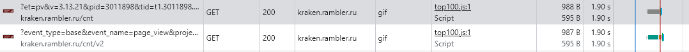

  ### 1.2.2) лишний размер ресурса

  - не удалены комментарии в html
  - не минимизирован css файл https://www.gd.ru/assets/f8e4500d/assets/frontend/css/layouts.other.css?cache=5a6fa72bdfc8007242bf089feb2ff92203bc8762 (и не используется)
  - оставлены комментарии для документации js-кода

  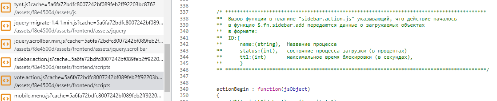

  ### 1.2.3) медленно загружающиеся ресурсы
  несторонних и медленных ресурсов, кроме основного html, не выявляется
  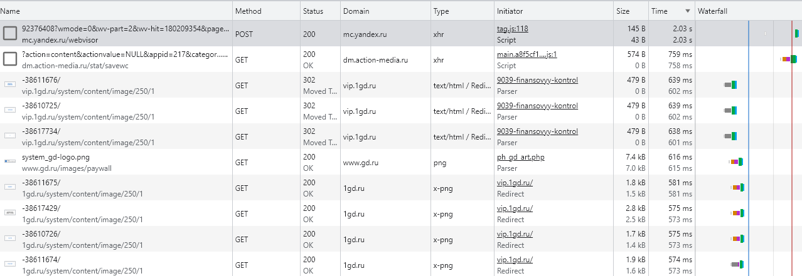

  ### 1.2.4) ресурсы, блокирующие загрузку

  скрипт содержит код для запуска загрузки других скриптов

  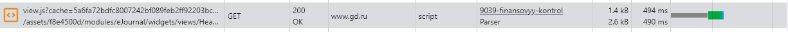

  ```
  $(document).ready(function () {
    try {
        $.ajax({
            url: headerRightBlockWidgetViewUrl,
            success: postContentSuccess,
            error: postContentError
        });
    }
    catch (e) {
        postContentError();
    }
});
  ```

  ### 1.2.5) что-то ещё -
  ---

# Performance

### 2.1) записать и сохранить в файл профиль загрузки страницы
[json с профилем](Trace-20230618T154509.json)

### 2.2) измерить время в миллисекундах от начала навигации до событий
- First Paint (FP) **1438.9 ms**
- First Contentful Paint (FCP) **1438.9 ms**
- Largest Contentful Paint (LCP) **3140.0 ms**
- DOM Content Loaded (DCL) **2697.9 ms**
- Load **3857.4 ms**

### 2.3) определить, на каком DOM-элементе происходит LCP
картинка
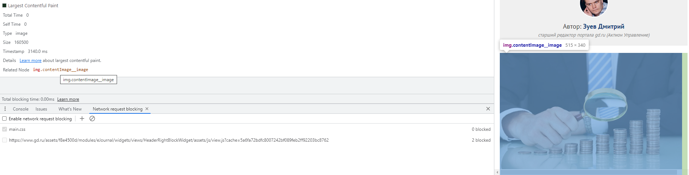

### 2.4) измерить, сколько времени в миллисекундах тратится на разные этапы обработки документа (Loading, Scripting, Rendering, Painting)
- Loading **57ms**
- Scripting **1248ms**
- Rendering **688ms**
- Painting **57ms**

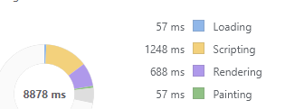

# Coverage

### 3.1) сохранить скриншот вкладки после загрузки страницы

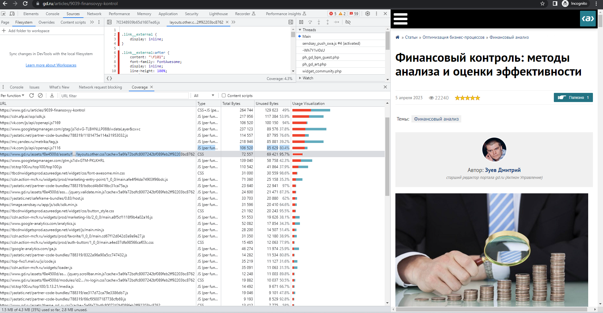

### 3.2) измерить в килобайтах объём неиспользованного CSS в ходе загрузки страницы

приблизительно 566 kB из 591 kB + 265 kB (css + html) не используются

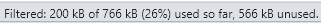

### 3.3) измерить в килобайтах объём неиспользованного JS в ходе загрузки страницы

приблизительно 2.3 MB из 3.6MB + 265 kB (css + html) не используются


